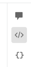

# Atomix - Trial for Frontend Developers (ReactJS, NextJS and TypeScript)
### Focusing on: ReactJS, NextJS, TypeScript and HTML and CSS skills

## Introduction
Hello everyone 👋🏼, firstly I would like to congratulate on being selected for a developer trial at [Atomix](https://www.atomix.com.au/). We are excited to see your skills and how you can contribute to our team. 
In regards to how we have structured the trial, it will be in two parts.

First part will test your frontend skills (HTML, CSS and responsive actions).\
Secondly, it will test your ReactJS, NextJS and TypeScript skills.

## Getting Started with Create Next App

This is a simple [Next.js](https://nextjs.org/) project bootstrapped with [`create-next-app`](https://github.com/vercel/next.js/tree/canary/packages/create-next-app).

To start this trial, you will need to create a responsive website using our creative to the closest pixel perfect layout. You can use a frontend framework or any additional JavaScript tools to complete this trial. Once you have completed the first trial, you can then proceed to the second trial.

Refer to this link for [API routes](https://nextjs.org/docs/api-routes/introduction)

## Step 1 - Instructions
Here is the [creative XD designs](https://xd.adobe.com/view/9b96df8b-7468-4806-9b66-1a0cd6e30fa4-cec5/) you need to start work on. By clicking on the `</>` icon on the right top corner, you will be able to access the assets and information for the creative layouts.

The design consists of a few important sections:
1. Implement the design sections in a component based structure
2. Header with a menu (global sections)
3. Home banner
3. Three column content section
4. Carousel with a slider. We recommend using [Flickity](https://flickity.metafizzy.co/), but you can use any JavaScript slider carousel here which you are familiar with
5. Team grid layout
6. Footer with menu links (global sections)

** Note: The layout also contain a mobile design to guide you with your responsive development

### 2. Header
The header contains several parts, and they need to be implemented accordingly. It contains a logo, menu and a call to action button. The menu contains a mega menu with additional links and all the header components need to support the mobile menu layouts as well.

### 7. Footer
The footer contains the footer menu, with a copyright text and social icons with links. The footer links need to support mobile designs and need to change to an accordion on smaller screens.

## Step 2 -  Instructions
Using the existing HTML and CSS/SCSS code, create a `data` folder and setup individual `.json` files for parts of the homepage content (navigation, banner content, team members and etc) and dynamically fetch the JSON data to the NextJS app.

** Note: We would like to see your TypeScript knowledge as much as possible.

## Step 3 - Optional
If you have additional time and if you are interested, can you implement a simple weather widget on the header section to the best of your ability using the `lat` and `lon` in the URL `https://api.openweathermap.org/data/2.5/weather?lat=34.9285&lon=138.6007&appid=[API_KEY]`.

It will require an API key, which you can sign up to get one from [OpenWeatherMap](https://openweathermap.org/api) or get in touch with us and we can provide one for you.

---
## Available Scripts

In the project directory, you can run:

#### `yarn install`

Installs the required packages from the `yarn.lock` file.

#### `yarn dev`

Runs the app in the development mode.\

Open [http://localhost:3000](http://localhost:3000) with your browser to see the result.

You can start editing the page by modifying `src/app/page.tsx`. The page auto-updates as you edit the file.

This project uses [`next/font`](https://nextjs.org/docs/basic-features/font-optimization) to automatically optimize and load Inter, a custom Google Font.

## How to submit your work?
Fork this repo and provide us with a pull request to view your work. You can also inform us by emailing to the person who contacted you in regards to the trial.

## How long do you have to complete this trial?
We recommend sending the completed pull request as soon as possible, but we would roughly estimate about a week to complete it. Please inform us if you have any concerns or clarifications with regards to the trial.
